# Exercise 1 - Loading and visualizing a public transportation network

In this exercise, we will look at the public transportation network of Adelaide, Australia.
First, we will load two sets of data. One is a list of Points of Interest (POIs) which we pull from OpenStreetMap (OSM). The other one is a GTFS (General Transportation Feed Specification) set of files. The GTFS files describe public transport schedules, so basically when busses/metros depart from stations. We will take a look at the GTFS datamodel and plot it on a map. In the last step, we will poll a GTFS API for real-time vehicle positions.

## Exercise 1.1 - Importing Points of Interest from OpenStreetMaps and General Transit Feed Specification data<a name="subex1"></a>

After completing these steps you will know how you can call the OSM overpass API and load geolocation data using "SAP HANA Python Client API for machine learning algorithms" (hana-ml).

We will run the [python code](code/2022_Q3_1_1_POI_and_GTFS_pub.ipynb) in a Jupyter Notebook, and the [SQL statements](code/2022_Q3_DA180_1_POI_and_GTFS) from a SQL console (SAP HANA Database Explorer or DBeaver). Below is the description of the important steps.

This is how we create a query for cafe/restaurant/bar type of amenities within 500m of Adelaide city center.
```` Python
# Get cafe|restaurant|bar amenities from 500m around Adelaide's center
# This query pulls a rather small amount of data from OSM
overpass_query = """
    [out:json];
    (
        node[amenity=cafe](around:500, -34.927975, 138.601394);
        node[amenity=restaurant](around:500, -34.927975, 138.601394);
        node[amenity=bar](around:500, -34.927975, 138.601394);
    );
    out geom;
"""
overpass_url = "http://overpass-api.de/api/interpreter"
response = requests.get(overpass_url, params={'data': overpass_query})
data_small = response.json()
````
The call returns data in JSON format which can be store in the SAP HANA JSON Document Store.
````python
# The overpass API resturns JSON which we can store in the HANA Document Store.
from hana_ml.docstore import create_collection_from_elements
coll = create_collection_from_elements(
    connection_context = cc,
    schema = schema,
    collection_name = 'POI_COLLECTION_SMALL',
    elements = data_small["elements"],
    drop_exist_coll = True)
  ````
  As an alternative, here is how you can flatten the data into a pandas dataframe...
  ````python
df_small = pd.json_normalize(data_small, record_path =['elements'])
df_small = df_small[['id','type','lon','lat','tags.amenity','tags.name']]
````
... and from the pandas dataframe into a HANA table. Note that hana-ml creates a geometry column in the table and makes a "real point geometry" from Lon/Lat coordinates.
````python
from hana_ml.dataframe import create_dataframe_from_pandas
hdf_pois_small = create_dataframe_from_pandas(
    connection_context=cc,
    pandas_df=df_small,
    schema=schema,
    table_name='POIS_SMALL',
    geo_cols=[("lon", "lat")], srid=4326,
    primary_key=('id'), allow_bigint=True,
    drop_exist_tab=True, force=True
    )
````
Let's see the data in HANA. The collection stores the data in JSON format.

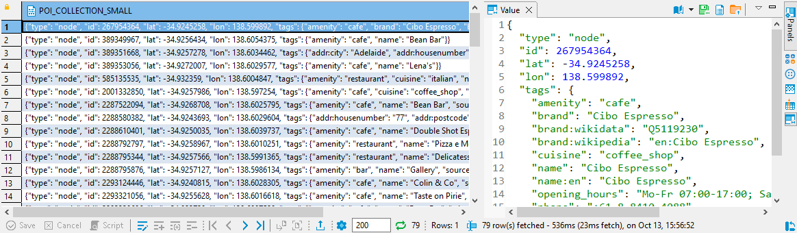
The HANA table contains the flattened subset of the POIs.

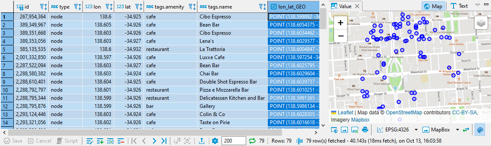

Next we will load the GTFS data. There is a nice [list of available GTFS datasets on Github](https://github.com/MobilityData/mobility-database-catalogs#browsing-and-consuming-the-spreadsheet). You can download the [Adelaide data](https://gtfs.adelaidemetro.com.au/v1/static/latest/google_transit.zip) as zip. This repo also contains a [copy][data/gtfs].
Like above, we are using pandas and hana-ml to bring in the data to HANA.
````python
from hana_ml.dataframe import create_dataframe_from_pandas
hdf_routes = create_dataframe_from_pandas(
    connection_context=cc,
    pandas_df=df_routes,
    schema=schema, drop_exist_tab=True,
    table_name='GTFS_ROUTES', force=True,
    primary_key='route_id'
    )
hdf_stops = create_dataframe_from_pandas(
    connection_context=cc,
    pandas_df=df_stops,
    schema=schema, drop_exist_tab=True,
    table_name='GTFS_STOPS', force=True, allow_bigint=True,
    geo_cols=[("stop_lon", "stop_lat")], srid=4326,
    primary_key='stop_id'
    )
    ...
````
## Exercise 1.2 - Understanding the GTFS datamodel<a name="subex2"></a>

Now we have created 5 tables in HANA: ROUTE, STOPS, TRIPS, SHAPES, and STOPTIMES. The [GTFS specification](https://gtfs.org/) comprises some more, but we'll focus on these 5.
ROUTES contains some masterdata about routes.

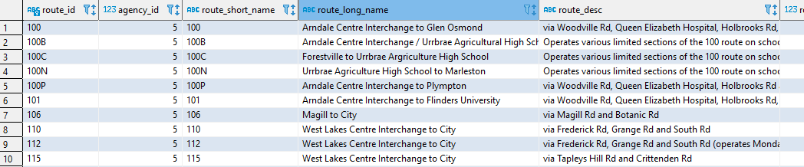

The STOPS have a geolocation.
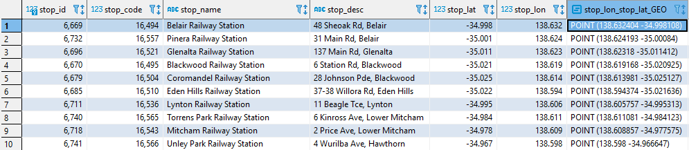

The TRIPS run on a ROUTE and are related to SHAPES.
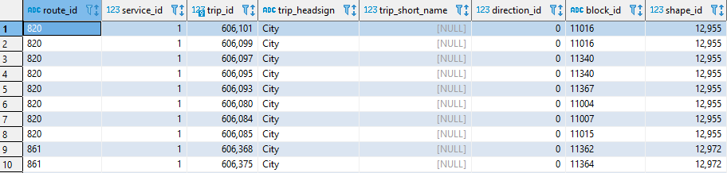

The SHAPES are an ordered set of points which make up a TRIP.
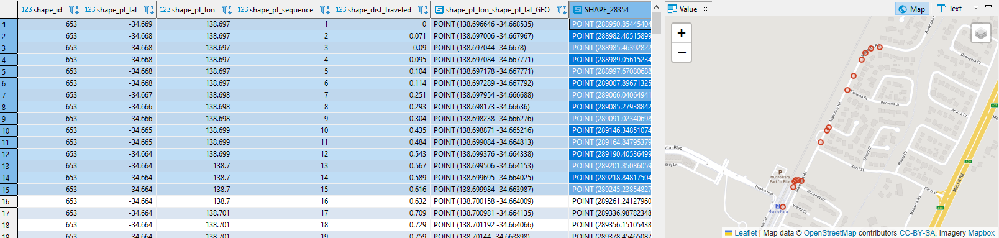

And finally, the STOPTIMES indicate when a TRIP's vehicle arrive and departs at a STOP.
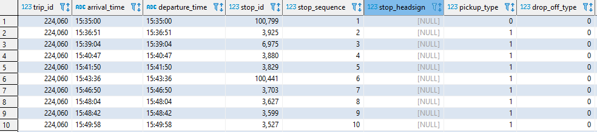

We can run a query to get all STOP locations of a TRIP. A TRIP relates to its STOPTIMES, which relates to STOPS, which have a geolocation.
````SQL
SELECT TRI."trip_id", ST_UNIONAGGR(STO."SHAPE_28354") AS LINE_OF_STOPS
	FROM "TECHED_USER_000"."GTFS_TRIPS" AS TRI,
    "TECHED_USER_000"."GTFS_STOPTIMES" AS ST,
    "TECHED_USER_000"."GTFS_STOPS" AS STO
	WHERE TRI."trip_id" = ST."trip_id" AND ST."stop_id" = STO."stop_id"
		AND TRI."trip_id" = 606101
	GROUP BY TRI."trip_id";
````
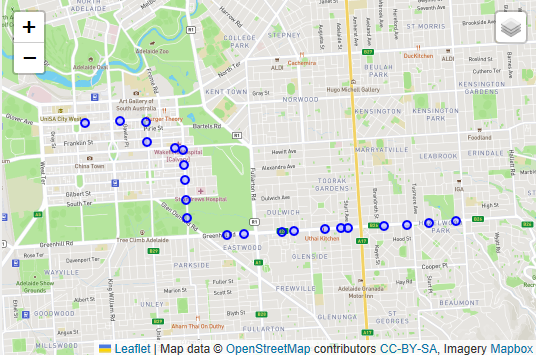

If we query the SHAPES of a TRIP we find the set of waypoints which describe the vehicle's path in detail.
````SQL
SELECT TRI."trip_id", ST_UNIONAGGR(SHA."SHAPE_28354") AS LINE_OF_SHAPES
	FROM "TECHED_USER_000"."GTFS_TRIPS" AS TRI,
    "TECHED_USER_000"."GTFS_SHAPES" AS SHA
	WHERE TRI."shape_id" = SHA."shape_id"
		AND TRI."trip_id" = 606101
	GROUP BY TRI."trip_id";
````
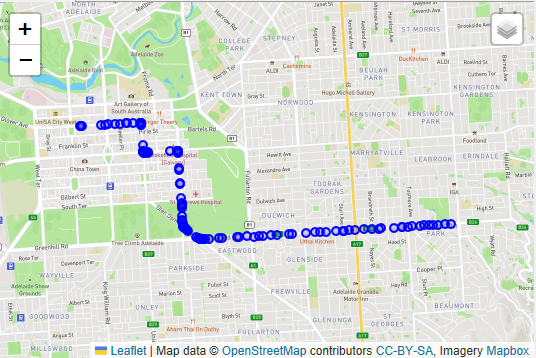

We want to visualize a TRIP's pathway as a linestring (not just an ordered set of point), so we concatenate the individual points and store the results in a table. This is how you could do it today in HANA (better functionality coming up ;-)).
````SQL
CREATE COLUMN TABLE "TECHED_USER_000"."GTFS_SHAPE_LINES"(
	"shape_id" NVARCHAR(5000) PRIMARY KEY,
	"SHAPE_28354" ST_GEOMETRY(28354)
);

INSERT INTO "TECHED_USER_000"."GTFS_SHAPE_LINES"("shape_id", "SHAPE_28354")
	SELECT "shape_id", ST_GEOMFROMTEXT('LINESTRING(' || string_agg(PAIRS, ',' ORDER BY "shape_pt_sequence") || ')', 4326).ST_TRANSFORM(28354) FROM
		(SELECT "shape_id", "shape_pt_sequence" , ("shape_pt_lon" ||' '|| "shape_pt_lat") AS PAIRS FROM "TECHED_USER_000"."GTFS_SHAPES")
	GROUP BY "shape_id";
````
A TRIP's path looks like this.

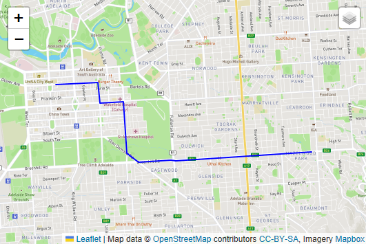

There are multiple TRIPs running on a ROUTE. ROUTE "BTANIC" is served more than 500 times a day.
````SQL
SELECT ROU."route_id", COUNT(*) AS "#TRIPS"
	FROM "TECHED_USER_000"."GTFS_ROUTES" AS ROU
	LEFT JOIN "TECHED_USER_000"."GTFS_TRIPS" AS TRI ON ROU."route_id" = TRI."route_id"
	GROUP BY ROU."route_id"
	ORDER BY "#TRIPS" DESC;
````
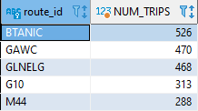

Not all TRIPs on a ROUTE are identical. Late at night, some ROUTES are not served at full length. So to get a ROUTES linestring for visualization, we will identify the longest of the ROUTE's TRIP. This time we'll just create a view.
````SQL
CREATE OR REPLACE VIEW "TECHED_USER_000"."V_ROUTE_LINES" AS
SELECT "route_id", "SHAPE_28354" FROM (
	SELECT *, RANK() OVER(PARTITION BY "route_id" ORDER BY NP DESC) AS R FROM
		(SELECT DISTINCT "route_id", SHAPE_28354, SHAPE_28354.ST_NumPoints() AS NP FROM "TECHED_USER_000"."V_TRIP_LINES")
	)
	WHERE R = 1;
````
There are more than 500 ROUTES, here are some of them... colorcoded in QGIS.
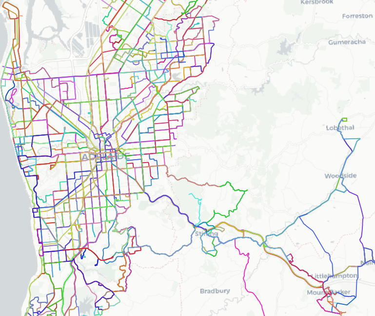

## Exercise 1.3 - Polling for real-time vehicle positions<a name="subex3"></a>
Some cities/public transport agencies not only provide static GTFS data, but also offer real-time APIs to poll for vehicle positions, trip updates, or service alerts. Most of these API use protobuffer as response format. Again, we use python/hana-ml to get vehicle positions and store them in a HANA table.

First, we define a function that gets the data and puts it in a pandas dataframe.
````python
def get_locations_as_df() -> pd.DataFrame:
    feed = gtfs_realtime_pb2.FeedMessage()
    response = requests.get('https://gtfs.adelaidemetro.com.au/v1/realtime/vehicle_positions')
    feed.ParseFromString(response.content)
    dict = protobuf_to_dict(feed)
    df = pd.json_normalize(dict['entity'])
    df['vehicle.timestamp'] = pd.to_datetime(df['vehicle.timestamp'], unit='s')
    return df
````
Then we define a function that uses ceate_dataframe_from_pands to store the data in a HANA table. We append the data to the "LOC_RT_HISTORY" so we get a history of vehicle positions. The data in "LOC_RT" is overwritten everytime we insert new data.
````python
def store_locations():
    df = get_locations_as_df()
    hdf_locations_history = create_dataframe_from_pandas(
        connection_context=cc,
        pandas_df=df,
        geo_cols=[("vehicle.position.longitude", "vehicle.position.latitude")], srid=4326,
        schema=schema,
        table_name='LOC_RT_HISTORY',
        force=False, append=True
    )
    hdf_locations = create_dataframe_from_pandas(
        connection_context=cc,
        pandas_df=df,
        geo_cols=[("vehicle.position.longitude", "vehicle.position.latitude")], srid=4326,
        schema=schema,
        table_name='LOC_RT',
        primary_key=['id','trip_id','route_id'],
        force=True
    )
````
Now we call the API every 15 seconds.
````python
import time
while True:
  store_locations()
  time.sleep(15)
````

We can plot the vehicle positions on a map and use some advance QGIS symbology to visualize the direction of the vehicle.
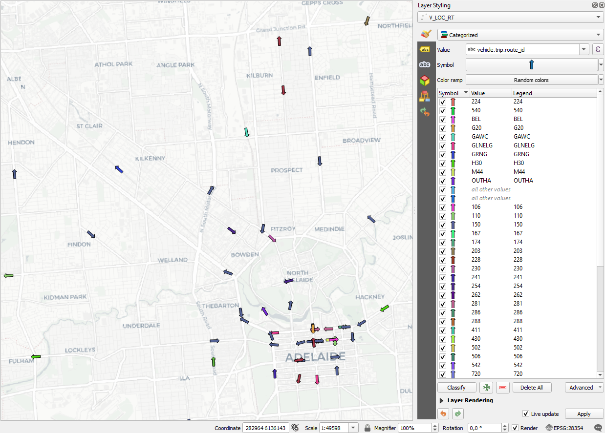

Using the historic data we can even add a 10 min trace.
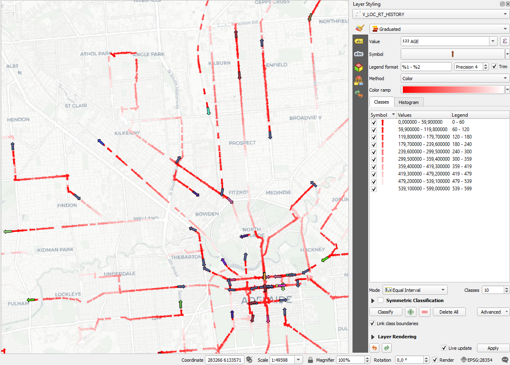

At last, we want to understand which of the vehicles are not where they are supposed to be. We check the distance between the current vehidle position and the TRIP's linestring.
````SQL
SELECT "id", "vehicle.trip.trip_id" AS "trip_id",
    "vehicle.trip.route_id" AS "route_id",
    "vehicle.position.longitude_vehicle.position.latitude_GEO" AS "LOC_4326",
    LOC."vehicle.timestamp",
    TRI."SHAPE_28354",
    "vehicle.position.longitude_vehicle.position.latitude_GEO".ST_TRANSFORM(28354).ST_DISTANCE(TRI."SHAPE_28354") AS "DIST"
	FROM TECHED_USER_000."LOC_RT" AS LOC
	LEFT JOIN TECHED_USER_000."V_TRIP_LINES" AS TRI ON LOC."vehicle.trip.trip_id" = TRI."trip_id"
````
The vehicle in line 6 is more than 1km away from its trip.
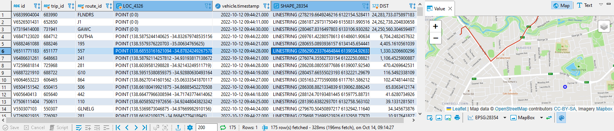

The vehicle in line 33 is perfectly on track.
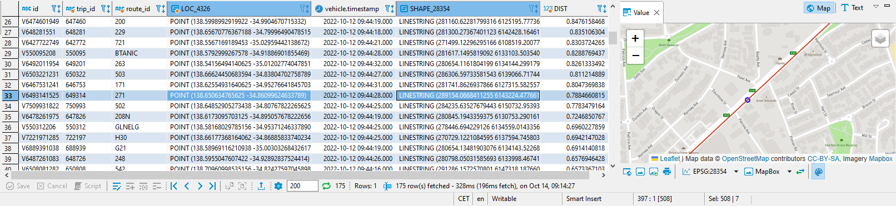


## Summary

You've now ...

Continue to - [Exercise 2 - Exercise 2 Description](../ex2/README.md)
