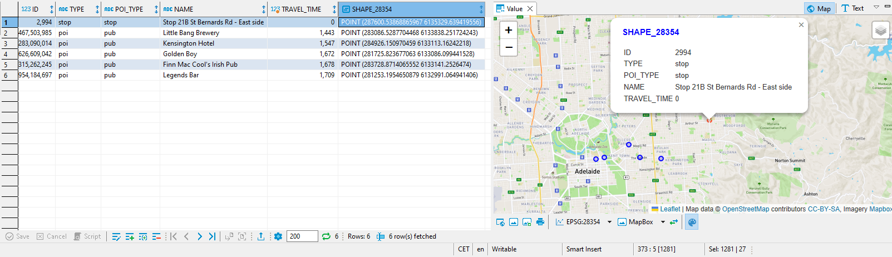

# Exercise 2 - Routing on a Spatio-Temporal Graph

**This page outline the sequence and most important steps of this exercise. The complete set of steps are in the code files.**
- The [SQL file](code/2022_Q3_DA180_Ex_2_Routing_pub.sql) contains all the statements for this exercise

In this exercise, we will look at the public transportation network of Adelaide, Australia, and learn how to run routing/pathfinding queries on this spatio-temporal network. For that, we create the networks edges and vertices from the GTFS data. Then we create a Graph Workspace in SAP HANA and run some "GraphScript" functions, which will answer "shortest path one-to-on" and "top k nearest neighbors" queries.

## Exercise 2.1 - Transform GTFS data and create a Graph Workspace<a name="subex1"></a>
So the GTFS data describes a network in which vehicles can take you from a STOP to another at certain times. To query the network for paths, we will use HANA's graph engine. To do that, we will transform the data into a set of EDGES (transport connections) and VERTICES (stops).
First, we will create EDGES from the STOPTIMES by creating SOURCE/TARGET pairs from subsequent stops of a trip.
````SQL
CREATE COLUMN TABLE "TECHED_USER_000"."EDGES" AS (
	SELECT "trip_id" , "SOURCE", "dep_time", "TARGET", "arr_time", 'transport' AS "transfer_type" FROM (
		SELECT "trip_id", "stop_sequence", "dep_time", "stop_id" AS "SOURCE",
			LEAD("arr_time") over (partition by "trip_id" order by "stop_sequence" ASC) as "arr_time",
			LEAD("stop_id") over (partition by "trip_id" order by "stop_sequence" ASC) as "TARGET"
			FROM "TECHED_USER_000"."GTFS_STOPTIMES"
		)
	WHERE "TARGET" IS NOT NULL AND "dep_time" IS NOT NULL AND "arr_time" IS NOT NULL
);
````
The EDGES table contains data about which TRIP takes you from a SOURCE (i.e. a stop) to a TARGET (i.e. the next stop). We have also added some additional columns, e.g. "diff_sec" which indicates how many seconds it takes to "traverse" this EDGE.


At this point, our network is just connected via STOPs, so we can change vehicles only if the share a STOP. But we can also walk, right? Let's add some data to the EDGES table by connecting STOPs which are closer than 500m. For simplicity reasons we just calculate the airline distance. In a real scenario we would calculate the walking distance.
````SQL
DO() BEGIN
	T_AllPairs = SELECT STO1."stop_id" AS "SOURCE", STO2."stop_id" AS "TARGET", STO1."SHAPE_28354".ST_DISTANCE(STO2."SHAPE_28354") AS "distance"
		FROM "TECHED_USER_000"."GTFS_STOPS" AS STO1
		INNER JOIN "TECHED_USER_000"."GTFS_STOPS" AS STO2 ON STO1."SHAPE_28354".ST_WITHINDISTANCE(STO2."SHAPE_28354", 500, 'meter') = 1;
	INSERT INTO "TECHED_USER_000"."EDGES"("SOURCE", "TARGET", "transfer_type", "diff_sec", "distance")
		SELECT "SOURCE", "TARGET", 'walk' AS "transfer_type", "distance"/1.2 AS "diff_sec", "distance"
	 	FROM :T_AllPairs WHERE "SOURCE" != "TARGET";
END;
````
Our "walk" EDGES don't have a trip_id, and no departure or arrival time. But we can derive "diff_sec" from the "distance". The assumption is that we can walk about 1.2m per second.


Finally, we will also connect the POIs to our network. The query below is similar to the last one and adds an EDGE from a STOP to a POI.
````SQL
DO() BEGIN
	T_AllPairs = SELECT STO."stop_id" AS "SOURCE", POI."id" AS "TARGET", STO."SHAPE_28354".ST_DISTANCE(POI."SHAPE_28354") AS "distance"
		FROM "TECHED_USER_000"."GTFS_STOPS" AS STO
		INNER JOIN "TECHED_USER_000"."POIS" AS POI ON STO."SHAPE_28354".ST_WITHINDISTANCE(POI."SHAPE_28354", 500, 'meter') = 1;
	INSERT INTO "TECHED_USER_000"."EDGES"("SOURCE", "TARGET", "transfer_type", "diff_sec", "distance")
		SELECT "SOURCE", "TARGET", 'walk' AS "transfer_type", "distance"/1.2 AS "diff_sec", "distance"
	 	FROM :T_AllPairs WHERE "SOURCE" != "TARGET";
END;
````
Our final EDGES table contains over 700k "transport" connections and over 200k "walk" connections.

Now let's create the graph's VERTICES. We'll use a view to union the STOPS and the POIs.
````SQL
CREATE OR REPLACE VIEW "TECHED_USER_000"."V_VERTICES" AS (
	SELECT "stop_id" AS "ID", 'stop' AS "TYPE", 'stop' AS "POI_TYPE", "stop_name" AS "NAME", "SHAPE_28354" FROM "TECHED_USER_000".GTFS_STOPS
	UNION
	SELECT "id" AS "ID", 'poi' AS "TYPE", "tags.amenity" AS "POI_TYPE", "tags.name" AS "NAME", "SHAPE_28354" FROM "TECHED_USER_000".POIS
);
````
The VERTCIES data looks like this. We got "poi" and "stop" type of vertices, a "NAME" column and a geolocation.


Looking at the "POI_TYPE" we see the following distribution in the VERTICES table.


Last task is to create a GRAPH WORKSPACE to expose the network to the graph engine.
````SQL
CREATE OR REPLACE GRAPH WORKSPACE "TECHED_USER_000"."GRAPH_GTFS_POIS"
	EDGE TABLE "TECHED_USER_000"."EDGES"
		SOURCE COLUMN "SOURCE"
		TARGET COLUMN "TARGET"
		KEY COLUMN "ID"
	VERTEX TABLE "TECHED_USER_000"."V_VERTICES"
		KEY COLUMN "ID";
````

## Exercise 2.2 - Shortest paths and traverse dijkstra<a name="subex2"></a>

The below GraphScript function will find shortest paths in the transportation network. It takes a start vertex, end vertex, and a parameter that indicates the time of our departure (in seconds), and returns a table with the path's edges. Basically, the program just calls the built-in "SHORTEST_PATH" algorithm, but the magic is in the edge weight expression... we need to tell the graph engine
- that we can only take "transport" connections that are in the future
- if we need to wait for a bus, the wait time needs to be added to our overall travel time
- we can take a "walk" at anytime

````SQL
CREATE OR REPLACE FUNCTION "TECHED_USER_000"."F_SPOO_GTFS_POIS"(
	IN i_startVertex BIGINT, 		-- the ID of the start vertex, this is a STOP or a POI
	IN i_endVertex BIGINT, 			-- the ID of the end vertex
	IN i_startSec INT				-- the time at which the TRIP should start, in seconds from midnight. So 9*3600 is 9am
	)
RETURNS TABLE ("ID" BIGINT, "EDGE_ORDER" BIGINT, "transfer_type" NVARCHAR(9), "trip_id" INT, "dep_sec" INT, "SOURCE" BIGINT, "arr_sec" INT, "TARGET" BIGINT, "diff_sec" INT, "distance" DOUBLE)
LANGUAGE GRAPH READS SQL DATA AS
BEGIN
	GRAPH g = Graph("TECHED_USER_000", "GRAPH_GTFS_POIS");
	VERTEX v_start = Vertex(:g, :i_startVertex);
	VERTEX v_end = Vertex(:g, :i_endVertex);
	WeightedPath<INT> p = SHORTEST_PATH(:g, :v_start, :v_end,
		(EDGE e, INT current_path_sec)=> INT{
  			IF(:e."transfer_type" == 'transport' AND (:i_startSec + :current_path_sec) <= :e."dep_sec") { -- the edge is a transport and the depature is in the future
  				RETURN (:e."dep_sec" - (:i_startSec + :current_path_sec)) + :e."diff_sec"; -- return potential wait time plus traverse time
  			}
            ELSE { -- the edge is a walk between stops
            	IF(:e."transfer_type" == 'walk') { RETURN :e."diff_sec"; } -- its a transfer, i.e. you can walk any time
            	ELSE { END TRAVERSE; } --not a valid edge
            }
  		}, 'OUTGOING');
	RETURN SELECT :e."ID", :EDGE_ORDER, :e."transfer_type", :e."trip_id", :e."dep_sec", :e."SOURCE", :e."arr_sec", :e."TARGET", :e."diff_sec", :e."distance"
		FOREACH e IN Edges(:p) WITH ORDINALITY AS EDGE_ORDER;
END;
````
If we execute this function with specific input, the result looks like this. First we need to walk a little bit, before we can hop on a bus at 20:12:37. The complete path is made of 79 edges and depicted on the map.


Next we want to calculate the travel time from one start vertex to all others. The SHORTEST_PATHS_ONE_TO_ALL built-in algorithm helps us to identify isochrones - areas which can be reached with the same time budget. The magic edge function in the middle is the same as above.
````SQL
CREATE OR REPLACE FUNCTION "TECHED_USER_000"."F_SPOA_GTFS_POIS"(
	IN i_startVertex BIGINT, 		-- the ID of the start vertex
	IN i_startSec INT
	)
RETURNS TABLE ("stop_id" BIGINT, "SHAPE_28354" ST_GEOMETRY(28354), "TRAVEL_TIME" INT)
LANGUAGE GRAPH READS SQL DATA AS
BEGIN
	GRAPH g = Graph("TECHED_USER_000", "GRAPH_GTFS_POIS");
	VERTEX v_start = Vertex(:g, :i_startVertex);
	GRAPH g_spoa = SHORTEST_PATHS_ONE_TO_ALL(:g, :v_start, "TRAVEL_TIME",
		(EDGE e, INT current_path_sec)=> INT{
  			IF(:e."transfer_type" == 'transport' AND (:i_startSec + :current_path_sec) <= :e."dep_sec") {
  				RETURN (:e."dep_sec" - (:i_startSec + :current_path_sec)) + :e."diff_sec"; -- potenital wait time plus traverse time
  			}
            ELSE {
            	IF(:e."transfer_type" == 'walk') { RETURN :e."diff_sec"; } -- its a transfer, i.e. you can walk any time
            	ELSE { END TRAVERSE; } --not a valid edge
            }
  		}, 'OUTGOING');
	RETURN SELECT :v."ID", :v."SHAPE_28354", :v."TRAVEL_TIME" FOREACH v IN Vertices(:g_spoa);
END;
````
Below are the 7am and 8pm isochrones for our start vertex (large green dot). The yellow area is reachable in within about 45 minutes. To reach the red areas take 2 hours or longer.


At the end of this exercise we want to find a pub. Remember that we connected the POI data to the transportation network? Let's explore which POIs are nearby our start location. The function below uses the TRAVERSE DIJKSTRA operator. This allows us to traverse the network in a "shortest path" manner, inspecting each vertex as we traverse. With this approach we can look for the top 5 pubs which we can reach with public transport at 8pm. Again, the edge weight function is the same as above, but we now check each visited vertex if it is a specific POI type ("pub"). If so, we collect the pubs until we found enough (5) and stop execution.
````SQL
CREATE OR REPLACE PROCEDURE "TECHED_USER_000"."F_TOP_K_NEAREST_POIS"(
	IN i_startVertex BIGINT,
	IN i_startSec INT,
	IN i_poiType NVARCHAR(5000),	-- NULL will find any amenity/POI; possible values are 'pub' or 'clinic'
	IN i_k BIGINT,					-- indicates how many POIs ARE returned
	OUT o_vertices TABLE ("ID" BIGINT, "TYPE" NVARCHAR(5000), "POI_TYPE" NVARCHAR(5000), "NAME" NVARCHAR(5000), "TRAVEL_TIME" INT, "SHAPE_28354" ST_GEOMETRY(28354)),
	OUT o_paths TABLE ("DISCOVERED_POI" BIGINT, "transfer_type" NVARCHAR(5000), "SOURCE" BIGINT, "TARGET" BIGINT, "diff_sec" INT, "distance" DOUBLE)
	)
LANGUAGE GRAPH READS SQL DATA AS
BEGIN
	GRAPH g = Graph("TECHED_USER_000", "GRAPH_GTFS_POIS");
	VERTEX v_start = Vertex(:g, :i_startVertex);
	MAP<VERTEX, INT> m_travelTimeMap = MAP<VERTEX, INT>(:g, :i_k);
	TRAVERSERESULT<INT> shortest_path_tree = TRAVERSERESULT<INT>(:g);
	TRAVERSE DIJKSTRA :g FROM :v_start WITH RESULT :shortest_path_tree WITH WEIGHT (EDGE e, INT current_path_sec)=> INT{
  			IF(:e."transfer_type" == 'transport' AND (:i_startSec + :current_path_sec) <= :e."dep_sec") { -- the edge is a transport and the depature is in the future
  				RETURN (:e."dep_sec" - (:i_startSec + :current_path_sec)) + :e."diff_sec"; -- return potential wait time plus traverse time
  			}
            ELSE { -- the edge is a walk between stops
            	IF(:e."transfer_type" == 'walk') { RETURN :e."diff_sec"; } -- its a transfer, i.e. you can walk any time
            	ELSE { END TRAVERSE; } --not a valid edge
            }
  		}
		ON VISIT VERTEX (Vertex v_visited, INT travel_time) {
			IF ( :v_visited."TYPE" == 'poi' AND (:v_visited."POI_TYPE" == :i_poiType OR :i_poiType IS NULL) ) { -- check if POI
				m_travelTimeMap[:v_visited] = :travel_time; -- store vertex AND distance IN the map
				IF (COUNT(:m_travelTimeMap) >= :i_k) { END TRAVERSE ALL; } -- if we found what we need, let's stop the traversal
			}
		};
	o_vertices = SELECT :v_discoveredVertex."ID", :v_discoveredVertex."TYPE", :v_discoveredVertex."POI_TYPE", :v_discoveredVertex."NAME", :travel_time, :v_discoveredVertex."SHAPE_28354"
		FOREACH (v_discoveredVertex, travel_time) IN :m_travelTimeMap;
	BIGINT idx = 1L;
	FOREACH (v_discoveredVertex, travel_time) IN :m_travelTimeMap {
    	WEIGHTEDPATH<INT> p = GET_PATH(:shortest_path_tree, :v_discoveredVertex);
    	FOREACH e IN Edges(:p) {
    		o_paths."DISCOVERED_POI"[:idx] = :v_discoveredVertex."ID";
    		o_paths."transfer_type"[:idx] = :e."transfer_type";
    		o_paths."SOURCE"[:idx] = :e."SOURCE";
    		o_paths."TARGET"[:idx] = :e."TARGET";
    		o_paths."diff_sec"[:idx] = :e."diff_sec";
    		o_paths."distance"[:idx] = :e."distance";
    		idx = :idx + 1L;
    	}
    }
END;
````
Here are the top 5 pubs which we can reached fastest at 8pm. Little Bang Brewery can be reach within 24 minutes.


The function also returns the paths to each target.


Interestingly, the top 5 clinics are much faster to reach.


## Summary

You've now ...

Continue to - [Exercise 3 - Import and export spatial vector and raster data, spatial clustering](../ex3/README.md)
