# Exercise 3 - Import and export spatial vector and raster data, spatial clustering

**This page outline the sequence and most important steps of this exercise. The complete set of steps are in the code files.**
- The [SQL file](code/2022_Q3_DA180_Ex_3_ImportExportRaster_pub.sql) contains all the statements for this exercise

In this exercise, we will deal with spatial vector and raster data. You can think of vector data as real geometries, e.g. polygons, and there are many file formats for vector data. Probably the most common format is Esri shapefiles. Spatial raster data are images. For each pixel in a spatial image, there is a specific spatial measure, e.g. the elevation or the land use class. Relational databases are not suitable to store images, but there are ways to convert a raster to a vector file.
First we will upload some spatial vector data. We'll start with an Esri shapefile and use SAP HANA Database Explorer to pull the data into a table. Next we will use QGIS to ingest a kml file.
We will then vectorize a raster file which contains information about population density and upload the data using GDAL.
Finally, we will show some spatial clustering techniques.

## Exercise 3.1 - Import and export spatial vector data<a name="subex1"></a>

There is some public data describing the [land use in Australia](https://data.sa.gov.au/data/dataset/land-use-generalised/resource/797444b1-633f-47ed-804d-fcbbeafca352). Since this file is pretty large, we "clipped" it. This clipped, downsized version of the land use data is the [data folder](../../data/vector).

Open the SAP HANA Database Explorer, right click on the T22 system, and choose "import data". A new screen opens, choose "import Esri shapefile".

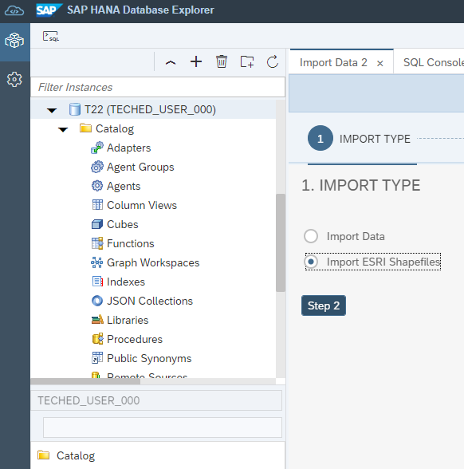

In the next step, choose the zip file which contains the shapefiles.

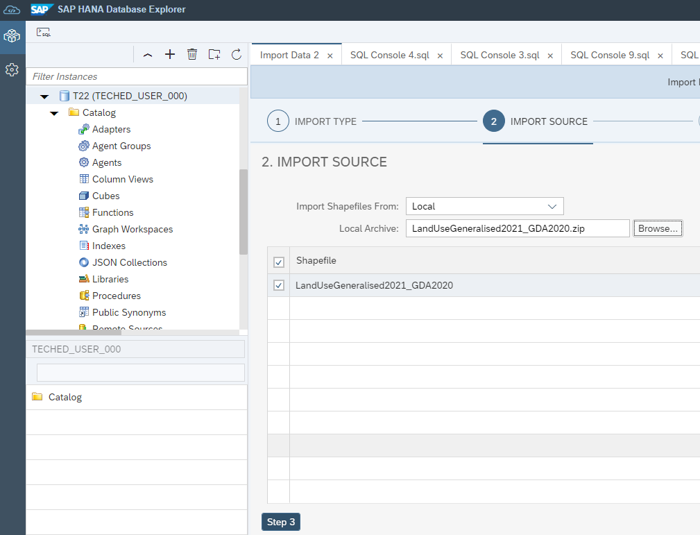

Then choose the database schema.

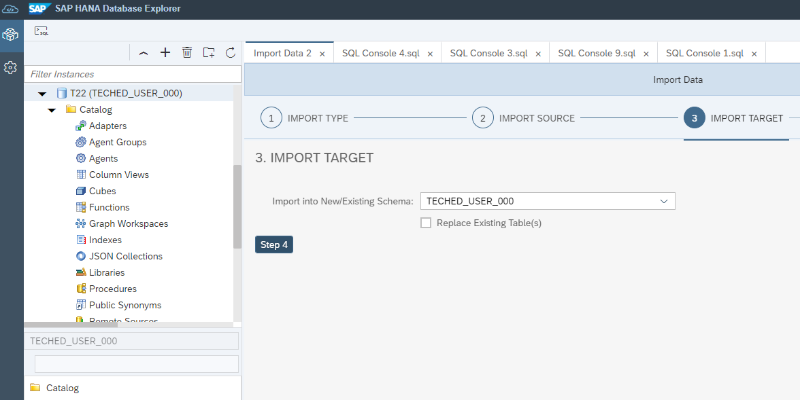

We need to provide the spatial reference system ID, which is 4326, and hit import.

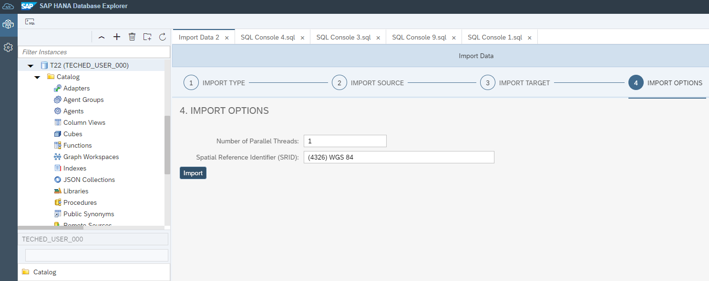

The imported data looks like this. There are polygons and land use descriptions.

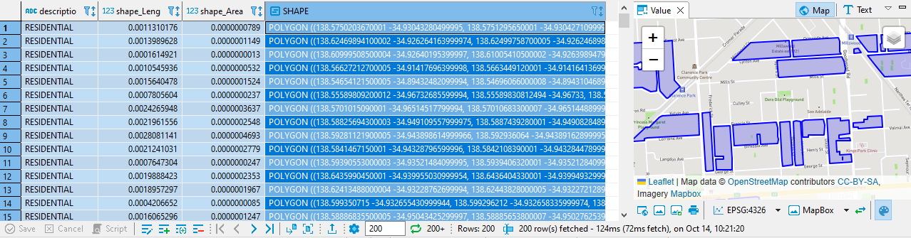

We can use QGIS for a more colorful visualization.

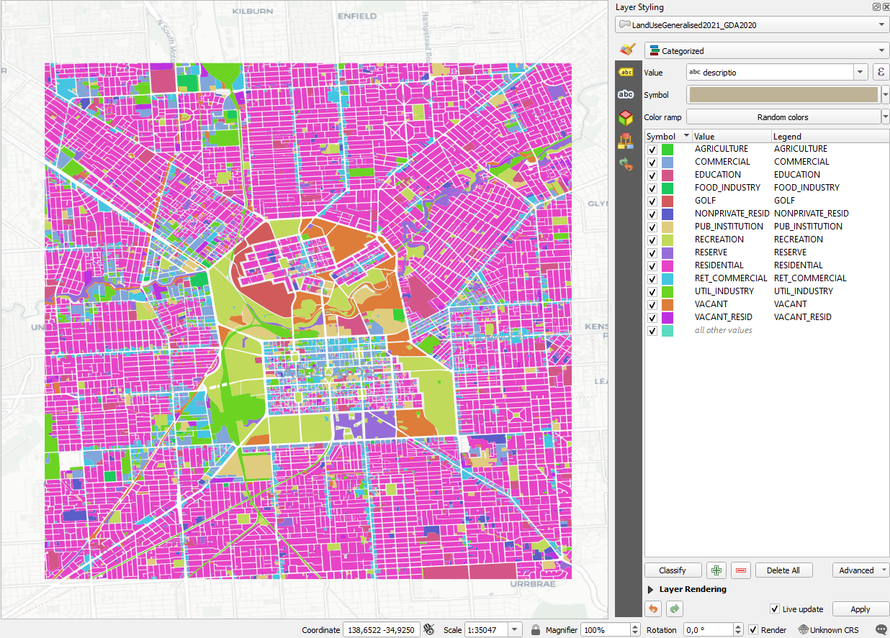

If you want to import other spatial vector file formats, you can use QGIS to import. Let's get a .kml file into HANA. Below you see the wards.kml file dragged onto the canvas of QGIS and subsequently into the HANA database.

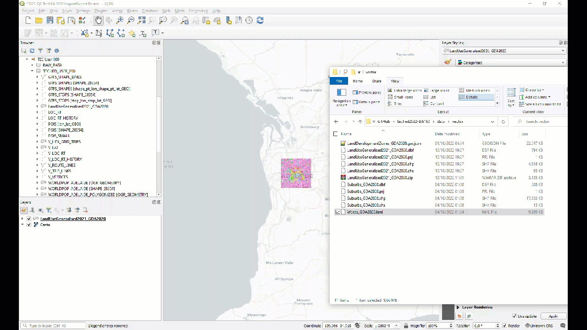

Exporting HANA data into a file is also easy. Below you see how to export the isochrones layer into a geopackage.

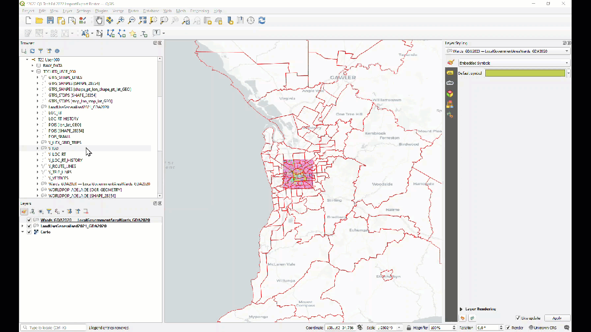


## Exercise 3.2 - Convert raster data using GDAL<a name="subex2"></a>

It was already mentioned that some georeferenced data comes in form of raster files, i.e. images. For example, Esri provide worldwide population density data in its ["Living Atlas"](https://www.arcgis.com/home/item.html?id=c90197b8948948d7b2194e1b03b11d1e). You'll find a .tif file in the [data folder of this repo](../../data/raster) that contains population density for the Adelaide region. We can simply drag&drop the file into QGIS.

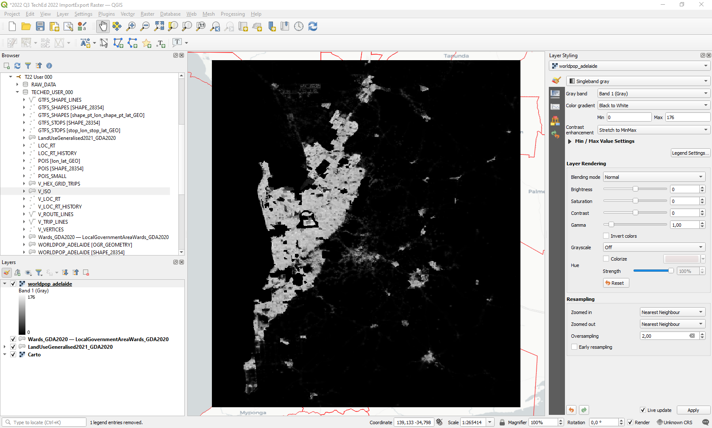

If we zoom in, we can see the individual pixels. The colors indicate the population density at each pixel location, ranging from 0=black to 179=white.

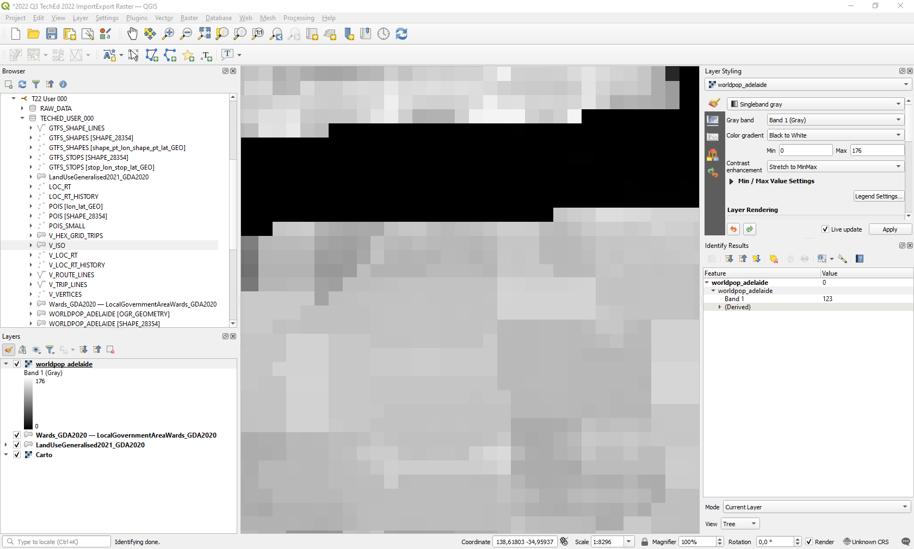

Now there are two main methods to convert raster files to vectors: polygonize and contour. The polygonize method groups adjacent pixels with the same values - in our case the same population density - and calculates the bounding polygon. The contour method creates contour lines at specified intervals. We know this from general maps where the elevation is captured as lines marking the 100m, 200m ... levels. You can use both methods within QGIS. The library that QGIS uses for these transformation is [GDAL](https://gdal.org/). GDAL is the "rosetta stone" for spatial formats. It let's you convert from basically every input format into every output format. Since there is a GDAL HANA adapter available since 2022, we will use GDAL directly from the command line.

First we try "contouring" our population density tif file by running the following command in an OS4GEO shell. We'll get contour lines for intervals of size 10 and store the output as a shapefile.

````
gdal_contour -p -amin DN -i 10.0 "C:\raster\worldpop_adelaide.tif" "C:\data\raster\contour\worldpop_adelaide_contour.shp"
````
If we bring the shapefile into QGIS and zoom in, we can see the individual polygons. Same colors indicate areas with the same population density.

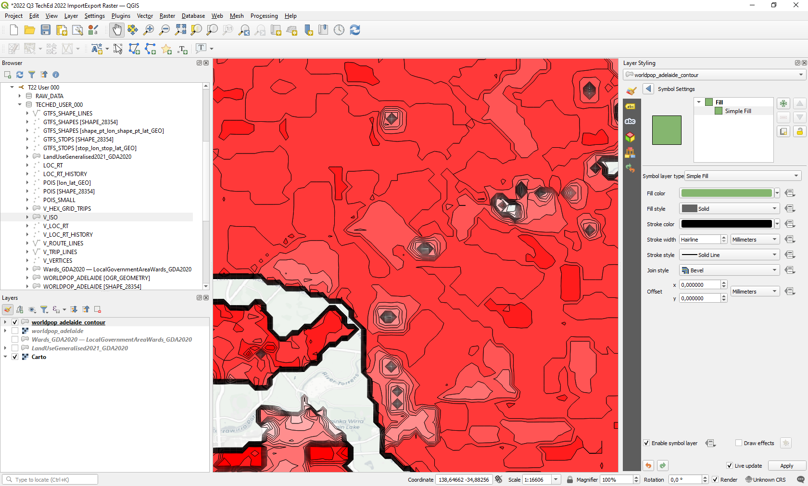

We can now bring in the contour data like we did before. But first let's try the other raster to vector transformation method: polygonize. Again we ran a command from the OS4GEO shell to let GDAL do the transformation.

````
gdal_polygonize "C:\raster\worldpop_adelaide.tif" "C:\raster\polygonized\worldpop_adelaide_polygonized.shp"
````
The next command takes the polygonized result and populates a HANA table.
````
ogr2ogr
  -s_srs "+proj=latlong +datum=WGS84 +axis=neu +wktext"
  -t_srs "+proj=latlong +datum=WGS84 +axis=enu +wktext"
  -f "HANA"
  -nln WORLDPOP_ADELAIDE_POLYGONIZED
  -progress -preserve_fid
  HANA:"DRIVER=HDBODBC;HOST=[host];PORT=443;USER=[user];PASSWORD=[pwd];SCHEMA=TECHED_USER_000"
  C:\data\raster\polygonized\worldpop_adelaide_polygonized.shp"
````
The resulting table in HANA looks like this. The polygon in line 7 covers an area in which the population density is 173.

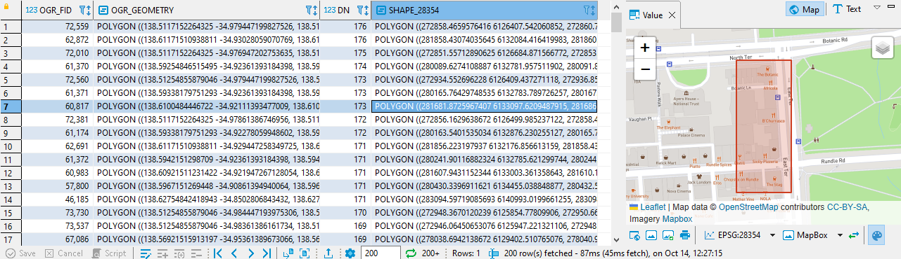

If we bring in the table into QGIS we can add some color.

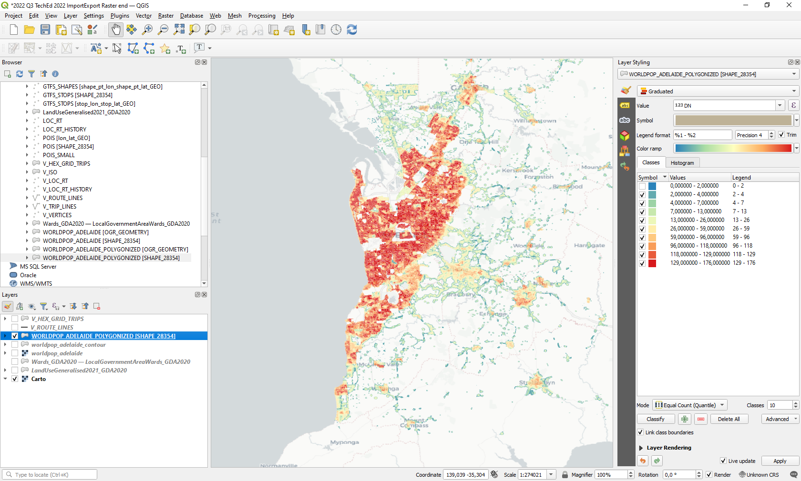

Now we can zoom in to see the individual polygons.

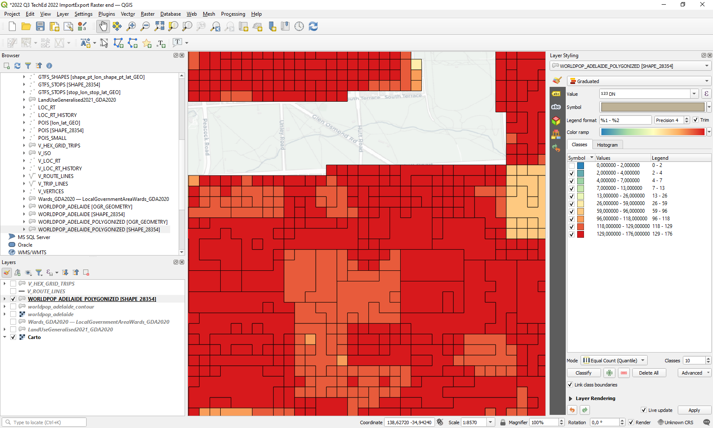

## Exercise 3.2 - Spatial clustering<a name="subex3"></a>

By now we have 3 types of geometries in the database: points (POIs), linestrings (triplines), and polygons (wards). Let's see how we can apply aggregation/clustering methods to derive additional insights.
- fixed location clustering
- hexagon clustering of points
- hexagon clustering of linestrings

Let's start simple and count the number of POIs in each ward.

````SQL
SELECT WAR."ward", COUNT(*) AS "NUM_POIS"
	FROM TECHED_USER_000."Wards_GDA2020 — LocalGovernmentAreaWards_GDA2020" AS WAR
	LEFT JOIN TECHED_USER_000.POIS AS POI ON POI.SHAPE_28354.ST_WITHIN(WAR.SHAPE_28354) = 1
	GROUP BY WAR."ward"
	ORDER BY "NUM_POIS" DESC;
````

We can see that the most POIs are within the CENTRAL WARD.

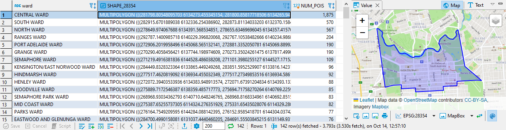

Let's add an additional GROUP BY attribute to get the distribution of POI types.

````SQL
SELECT WAR."ward", POI."tags.amenity", COUNT(*) AS "NUM_POIS"
	FROM TECHED_USER_000."Wards_GDA2020 — LocalGovernmentAreaWards_GDA2020" AS WAR
	LEFT JOIN TECHED_USER_000.POIS AS POI ON POI.SHAPE_28354.ST_WITHIN(WAR.SHAPE_28354) = 1
	GROUP BY WAR."ward", POI."tags.amenity"
	ORDER BY WAR."ward", "NUM_POIS" DESC;
````

There are a lot of benches in the CENTRAL WARD.

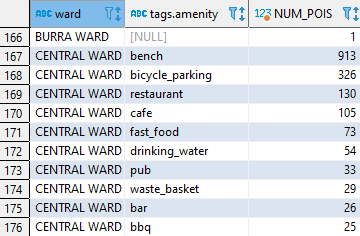

Instead of grouping the points by fixed location (wards), you can also let HANA generate a regular hexagon grid that covers the POIs. There is built-in SQL syntax for this: GROUP CLUSTER BY.

````SQL
SELECT ST_ClusterID() AS "LOCATION_ID", ST_ClusterCell() AS "CCELL", COUNT(*) AS "NUM_POIS"
	FROM TECHED_USER_000."POIS"
	GROUP CLUSTER BY "SHAPE_28354" USING HEXAGON X CELLS 40;
````
The area of POIs is tessellated with hexagon grid cells.

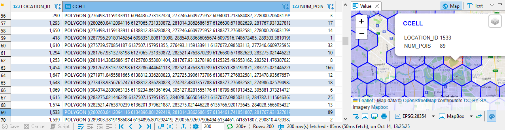

If you want to use an additional GROUP BY attribute ("tags.amenity"), you have to run the spatial clustering in a window function.

````SQL
SELECT "id", "tags.amenity",
		ST_ClusterId() OVER (CLUSTER BY "SHAPE_28354" USING HEXAGON X CELLS 40) "CID",
		ST_ClusterCell() OVER (CLUSTER BY "SHAPE_28354" USING HEXAGON X CELLS 40) AS "CCELL"
		FROM TECHED_USER_000."POIS"
````

This query assigns a cluster ID and CELL to each POI.

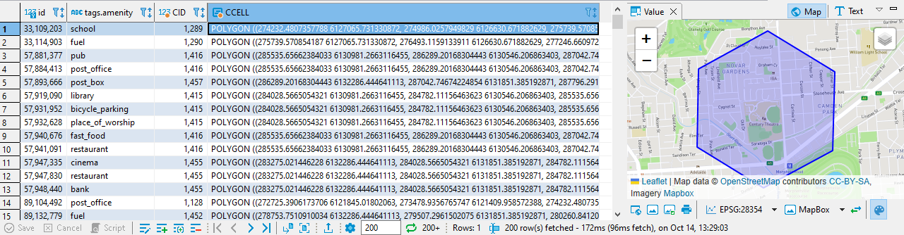

You can now use any SQL aggregation on this result.

````SQL
SELECT "CID", "CCELL", "tags.amenity", COUNT(*) AS "NUM_POIS" FROM (
	SELECT "id", "tags.amenity",
		ST_ClusterId() OVER (CLUSTER BY "SHAPE_28354" USING HEXAGON X CELLS 40) "CID",
		ST_ClusterCell() OVER (CLUSTER BY "SHAPE_28354" USING HEXAGON X CELLS 40) AS "CCELL"
		FROM TECHED_USER_000."POIS"
	)
	GROUP BY "CID", "CCELL", "tags.amenity"
	ORDER BY "CID", "C" DESC;
````

The result looks like this.

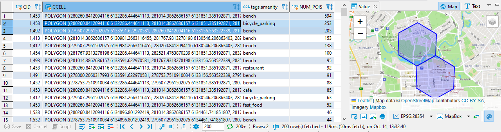

The built-in spatial clustering used above support point geometries only. What if you want to count linestrings or polygons intersecting the hexagon cells? Let's say we want to count the number of TRIPs that go through an area? For this you can generate a hexagon grid "standalone" and use the ST_Intersects method to identify linestrings that intersect the grid cells. The grid generator functions take a geometry which should be covered by the grid.

````SQL
SELECT "I"||'#'||"J" AS "LOCATION_ID", "GEOM" AS "CCELL"
		FROM ST_HexagonGrid(2000, 'HORIZONTAL',	ST_GeomFromEWKT('SRID=4326;LINESTRING(138.40561 -35.35189, 139.06481 -34.58470)').ST_TRANSFORM(28354));
````

What you get is a plain grid.

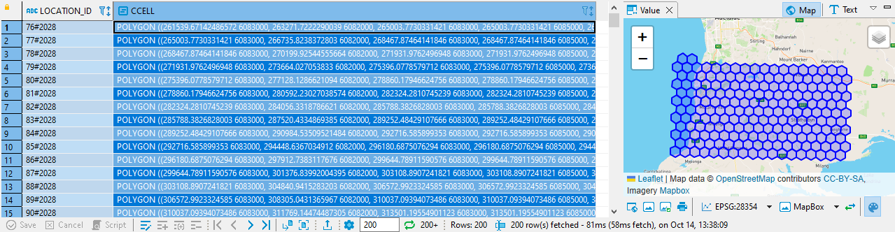

Now let's intersect the TRIP_SHAPES table which we created in the first exercise.

````SQL
SELECT "LOCATION_ID", "CCELL", COUNT(*) AS "NUM_TRIPS", COUNT(DISTINCT "route_id") AS "NUM_ROUTES" FROM (
	(SELECT "I"||'#'||"J" AS "LOCATION_ID", "GEOM" AS "CCELL"
		FROM ST_HexagonGrid(1000, 'HORIZONTAL', ST_GeomFromEWKT('SRID=4326;LINESTRING(138.40561 -35.35189, 139.06481 -34.58470)').ST_TRANSFORM(28354))
	) AS GRID
	INNER JOIN "TECHED_USER_000"."V_TRIP_LINES" AS "TRILIN" ON "TRILIN"."SHAPE_28354".ST_Intersects("GRID"."CCELL") = 1)
	GROUP BY "LOCATION_ID", "CCELL";
````

We can visualize the result in QGIS. Red indicates an area with many transportation trips going through that cell.

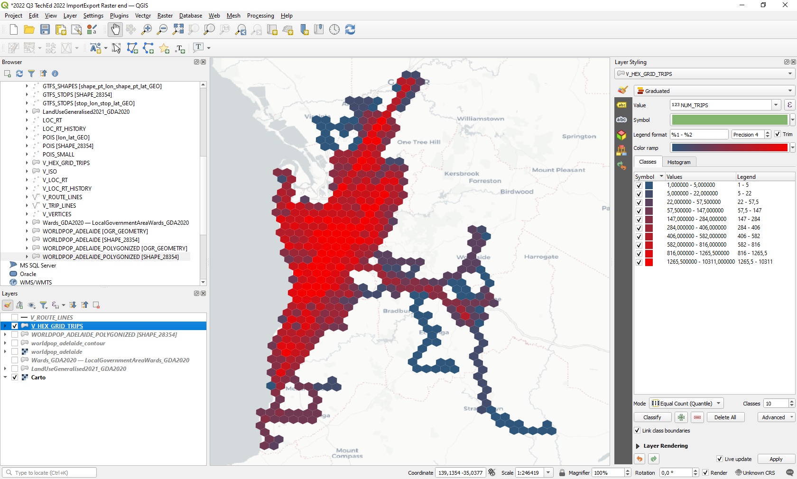

We can overlay the ROUTE lines to add context.

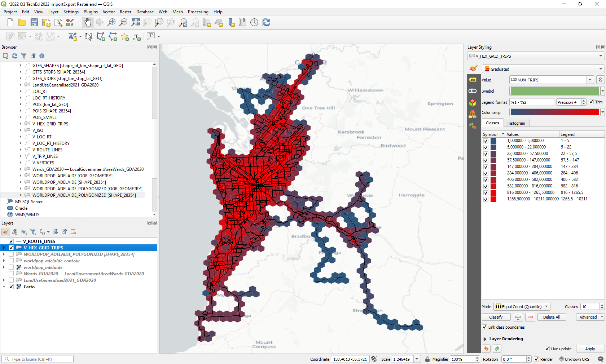

## Summary

You've now ...

Continue to - [Exercise 4 - Excercise 4 ](../ex3/README.md)
