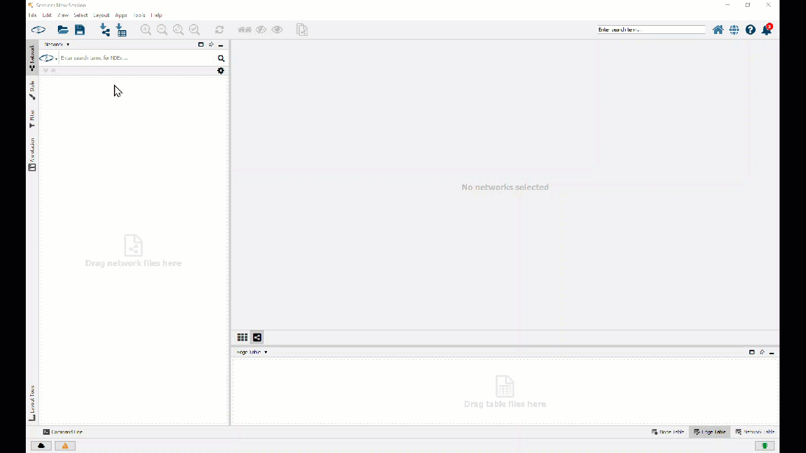

# Exercise 4 - Export and import graphs

**This page outlines the sequence and most important steps of this exercise. The complete set of steps are in the code files.**
- The [SQL file](code/2022_Q3_DQ180_Ex4_ExportImportGraphs_pub.sql) contains all the statements for this exercise

<hr>

In this exercise, we will create a new graph from the GTFS network which depicts how `ROUTES` are connected by common `STOPS`.
We then load this graph into [Cytoscape](https://cytoscape.org/) using a [SAP HANA plug-in](https://github.com/SAP/sap-hana-plugin-for-cytoscape) for advanced visualization. In exercise 2 we'll go the other way - we import a graph from Cytoscape into SAP HANA.

## Exercise 4.1 Export a graph<a name="subex1"></a>

The graph we created in exercise 2 is made from `STOP` vertices connected by `TRIP` edges. Let's take another perspective on this network. We'll use `ROUTES` - `RouteGroups` to be precise - as vertices and connect them if they share a `STOP`.

First we create the `EDGES`.
````SQL
CREATE OR REPLACE VIEW "TECHED_USER_000"."V_ROUTE_EDGES" AS (
	WITH ROU AS ( -- get all a routegroups's stops
		SELECT DISTINCT ROU."agency_id", ROU."RouteGroup", ST."stop_id"
			FROM "TECHED_USER_000"."GTFS_ROUTES" AS ROU
			LEFT JOIN "TECHED_USER_000"."GTFS_TRIPS" AS TRI ON ROU."route_id" = TRI."route_id"
			LEFT JOIN "TECHED_USER_000"."GTFS_STOPTIMES" AS ST ON TRI."trip_id" = ST."trip_id"
			WHERE "RouteGroup" IS NOT NULL
	)
	SELECT ROU1."RouteGroup"||'#'||ROU2."RouteGroup" AS "ID", ROU1."RouteGroup" AS "SOURCE", ROU2."RouteGroup" AS "TARGET", COUNT(*) AS "NUM_SHARED_STOPS"
		FROM ROU AS ROU1, ROU AS ROU2
		WHERE ROU1."stop_id" = ROU2."stop_id" AND ROU1."RouteGroup" < ROU2."RouteGroup" -- join two distinct routegroups if they share a stop
		GROUP BY ROU1."RouteGroup", ROU2."RouteGroup"
);
````
The `EDGES` look like this. `RouteGroup` '106' is connected to `RouteGroup` 'H20-H21-580' by 7 common `STOPS`.


The `VERTICES` are simply the `RouteGroups` of the `ROUTES` table.
````SQL
CREATE OR REPLACE VIEW "TECHED_USER_000"."V_ROUTE_VERTICES" AS (
  SELECT DISTINCT "RouteGroup", "agency_id"
  FROM "TECHED_USER_000"."GTFS_ROUTES"
  WHERE "RouteGroup" IS NOT NULL
);
````

Like in exercise 1 we create a `GRAPH WORKSPACE` pointing to our `EDGES` and `VERTICES`.

````SQL
CREATE OR REPLACE GRAPH WORKSPACE "TECHED_USER_000"."GRAPH_GTFS_ROUTES"
	EDGE TABLE "TECHED_USER_000"."V_ROUTE_EDGES"
		SOURCE COLUMN "SOURCE"
		TARGET COLUMN "TARGET"
		KEY COLUMN "ID"
	VERTEX TABLE "TECHED_USER_000"."V_ROUTE_VERTICES"
		KEY COLUMN "RouteGroup";
````

This `GRAPH WORKSAPCE` can be loaded into Cytoscape using the SAP HANA plug-in.



Using filters and different layout algorithms we can start to understand how routes are connected.


## Exercise 4.2 Import a graph<a name="subex2"></a>

The SAP HANA plug-in for Cytoscape works both ways - import and export.
Let's take a [public graph stored in .graphml format](https://researchgraph.org/nci-research-graph/), open it on Cytoscape, and load it into SAP HANA.


We can then analyze the graph and connect it to other datasources in SAP HANA.


## Summary

You've now exported and imported a graph.

Continue to - [Exercise 5 - Apply Forecasting to multi-model data](../ex5/README.md)
